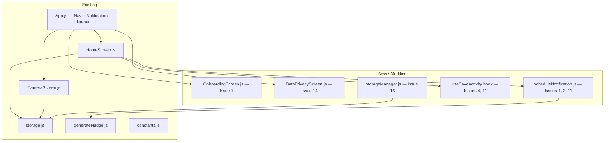
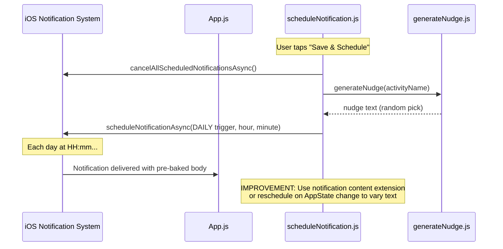
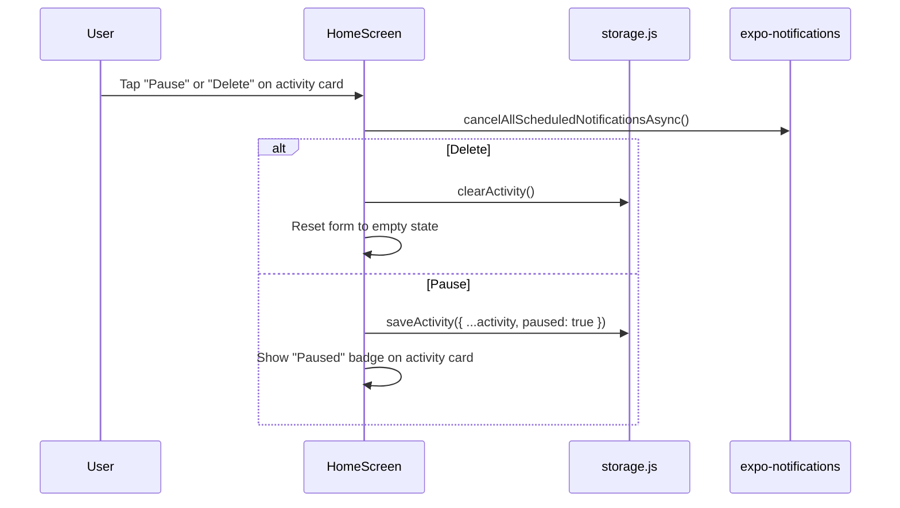
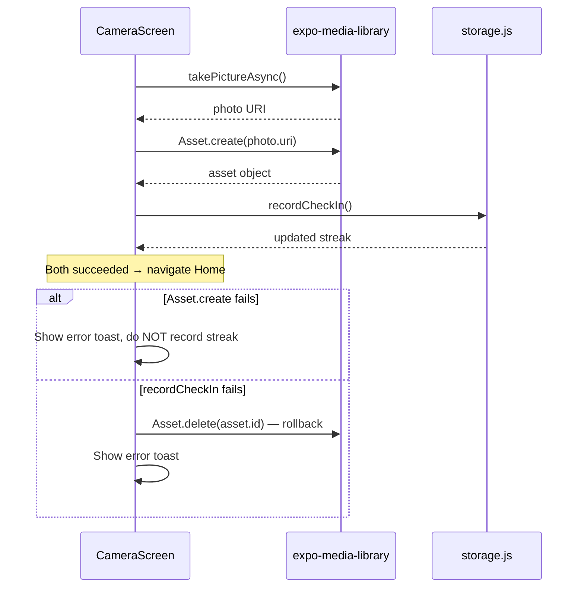

# Design Document: iOS Launch Hardening

## Overview

This spec addresses 16 production issues that must be resolved before the PRESENT app can ship on the iOS App Store. The app is an Expo SDK 57 managed-workflow React Native app (iOS only) with a two-screen stack (Home → Camera), local notifications, and AsyncStorage persistence. Each issue is an incremental fix to the existing codebase — no rewrites, no new screens beyond onboarding, no backend.

The issues span notification reliability, UX polish, data integrity, privacy compliance, and defensive coding. They are ordered by priority and grouped into logical themes for implementation.

## Architecture



## Sequence Diagrams

### Issue 1 + 2: Dynamic Nudge with Timezone-Aware Scheduling



**Design decision for Issue 1**: Expo's `DAILY` trigger bakes the content at schedule time. Two practical approaches:
1. **Rolling window** — schedule N notifications (e.g., 7 days ahead) each with a different nudge, then reschedule weekly via a background event or app-foreground hook.
2. **Reschedule on foreground** — every time the app becomes active, cancel the existing notification and re-schedule with a fresh nudge for the next occurrence.

Option 2 is simpler and sufficient for an app users open daily. If a user never opens the app for multiple days, they get the same nudge — acceptable for v1.

### Issue 3: Delete/Pause Activity Flow



### Issue 10: Transactional Check-In



## Components and Interfaces

### Component 1: scheduleNotification.js (New)

**Purpose**: Centralize notification scheduling logic. Handles fresh-nudge generation, timezone-aware rescheduling, and deduplication (race condition guard).

```javascript
// src/utils/scheduleNotification.js

/**
 * Schedule (or reschedule) the daily nudge notification.
 * Cancels any existing scheduled notifications before scheduling.
 *
 * @param {string} activityName - The activity to mention in the nudge
 * @param {number} hour - Hour (0-23)
 * @param {number} minute - Minute (0-59)
 * @returns {Promise<string>} The notification identifier
 */
export async function scheduleDailyNudge(activityName, hour, minute) { }

/**
 * Cancel all scheduled notifications (used on delete/pause).
 * @returns {Promise<void>}
 */
export async function cancelAllNudges() { }

/**
 * Reschedule with a fresh nudge text. Called on app foreground
 * to rotate the message (Issue 1) and handle TZ/DST shifts (Issue 2).
 * @returns {Promise<void>}
 */
export async function refreshNudgeOnForeground() { }
```

**Responsibilities**:
- Single source of truth for scheduling logic
- Generates fresh nudge text on every (re)schedule
- Guards against rapid double-calls (Issue 11) with a lock flag
- Reads stored activity to know hour/minute for rescheduling

### Component 2: useSaveActivity Hook (New)

**Purpose**: Encapsulate the save-and-schedule flow with loading state, error handling, and double-tap prevention.

```javascript
// src/hooks/useSaveActivity.js

/**
 * @returns {{
 *   isSaving: boolean,
 *   saveAndSchedule: (name: string, time: Date) => Promise<boolean>,
 *   error: string | null
 * }}
 */
export function useSaveActivity() { }
```

**Responsibilities**:
- Exposes `isSaving` for spinner/disabled state (Issue 4)
- Internally uses a ref-based lock to reject concurrent calls (Issue 11)
- Returns success/failure boolean for toast feedback

### Component 3: OnboardingScreen.js (New)

**Purpose**: First-time user explanation (Issue 7).

```javascript
// src/screens/OnboardingScreen.js

// A 2-3 page swipeable intro shown once on first launch.
// Stored flag: @present_onboarding_done = "true"
// After completion, navigates to Home and never shows again.
```

**Responsibilities**:
- Explain the loop: schedule → nudge → photo → streak
- Request notification permission proactively with context
- Set a flag in AsyncStorage so it only shows once

### Component 4: DataPrivacyScreen.js (New)

**Purpose**: Allow users to export or delete their data (Issue 14 — GDPR).

```javascript
// src/screens/DataPrivacyScreen.js

/**
 * Provides:
 * - "Export My Data" — serializes all AsyncStorage keys to a shareable JSON file
 * - "Delete All Data" — clears AsyncStorage + cancels notifications + shows confirmation
 */
```

## Data Models

### Extended Activity Model

```javascript
// Current: { name: string, time: string }
// Extended:
/**
 * @typedef {Object} Activity
 * @property {string} name - Activity name
 * @property {string} time - "HH:mm" string
 * @property {boolean} [paused] - If true, notification is not scheduled (Issue 3)
 * @property {string} [createdAt] - ISO timestamp for data export
 */
```

**Validation Rules**:
- `name` must be a non-empty trimmed string
- `time` must match `/^\d{2}:\d{2}$/`
- `paused` defaults to `false` if absent (backward compatible)

### New Storage Keys

```javascript
// src/constants.js additions
export const ONBOARDING_KEY = '@present_onboarding_done';  // "true" | absent
export const PHOTOS_KEY = '@present_photos';               // JSON array of { uri, date }
export const PHOTO_COUNT_KEY = '@present_photo_count';     // JSON integer >= 0
```

### Photo Counter Model

```javascript
/**
 * @typedef {Object} PhotoRecord
 * @property {string} uri  - Media library asset URI
 * @property {string} date - "YYYY-MM-DD" in device local time
 */

/**
 * PHOTOS_KEY      -> PhotoRecord[]        (append-only, grows with every check-in)
 * PHOTO_COUNT_KEY -> number               (invariant: === PhotoRecord[].length)
 */
```

**Why a separate counter (Requirements 12.1, 12.4, 12.6, 12.7)**: the Home_Screen needs a photo count on every focus, but parsing a 1000-record array on each focus is the cost the bounded-refresh requirement exists to remove. The counter is the authoritative source for the displayed count at *every* index length, not only above some threshold.

**Consistency rules**:
- The Camera_Screen writes `PHOTOS_KEY` and `PHOTO_COUNT_KEY` in a single `multiSet` call, so a failed append leaves both values at their previous state (Requirement 12.7).
- If the counter is absent or is not an integer ≥ 0, the Home_Screen performs one extra `PHOTOS_KEY` read, derives the length, and writes the counter back — a self-healing path for records written before this key existed (Requirement 12.6).
- `PHOTO_COUNT_KEY` is included in the data export and in Delete All Data alongside the other four keys (Requirements 11.2, 11.6). Leaving it behind on deletion would let a stale count survive a wipe.

## Algorithmic Pseudocode

### Algorithm: Refresh Nudge on Foreground (Issues 1 + 2)

```javascript
// Called from App.js AppState listener when state becomes 'active'
async function refreshNudgeOnForeground() {
  // Precondition: App has just come to foreground
  const activity = await loadActivity();
  
  // If no activity or paused, nothing to do
  if (!activity || activity.paused) return;

  const [hours, minutes] = activity.time.split(':').map(Number);

  // Cancel existing and reschedule with fresh nudge text
  await Notifications.cancelAllScheduledNotificationsAsync();
  
  const nudge = generateNudge(activity.name);
  
  await Notifications.scheduleNotificationAsync({
    content: { title: 'PRESENT', body: nudge },
    trigger: {
      type: Notifications.SchedulableTriggerInputTypes.DAILY,
      hour: hours,
      minute: minutes,
    },
  });
}
```

**Preconditions**:
- App is transitioning to active state
- AsyncStorage is accessible

**Postconditions**:
- If activity exists and is not paused: exactly one DAILY notification is scheduled with a freshly generated nudge
- If no activity or paused: zero notifications scheduled
- Timezone/DST handled because re-scheduling uses the OS's current timezone interpretation of hour/minute

### Algorithm: Transactional Check-In (Issue 10)

```javascript
async function handleCapture() {
  if (isCapturing || !cameraRef.current) return;
  setIsCapturing(true);

  let asset = null;

  try {
    const photo = await cameraRef.current.takePictureAsync();
    
    // Step 1: Save photo
    asset = await MediaLibrary.Asset.create(photo.uri);
    
    // Step 2: Record streak — if this fails, roll back photo
    try {
      await recordCheckIn();
    } catch (streakError) {
      // Rollback: delete the saved photo
      if (asset) {
        await MediaLibrary.deleteAssetsAsync([asset.id]).catch(() => {});
      }
      throw streakError;
    }
    
    // Both succeeded
    navigation.navigate('Home');
  } catch (error) {
    console.warn('Check-in failed:', error);
    // Show user-facing error message
    Alert.alert('Check-in failed', 'Something went wrong. Please try again.');
  } finally {
    // CRITICAL: Always reset isCapturing (Issue 9)
    setIsCapturing(false);
  }
}
```

**Preconditions**:
- `isCapturing` is false
- `cameraRef.current` is non-null
- Camera and media library permissions are granted

**Postconditions**:
- Success: photo saved AND streak recorded AND navigated to Home AND `isCapturing` is false
- Photo save failure: no streak recorded, `isCapturing` reset, error shown
- Streak failure: photo rolled back, `isCapturing` reset, error shown
- Any path: `isCapturing` is always reset (fixes Issue 9)

**Loop Invariants**: N/A (no loops)

### Algorithm: Double-Tap Prevention (Issue 11)

```javascript
// Inside useSaveActivity hook
const isSavingRef = useRef(false);
const [isSaving, setIsSaving] = useState(false);

async function saveAndSchedule(name, time) {
  // Ref-based lock — survives across renders and prevents concurrent calls
  if (isSavingRef.current) return false;
  
  isSavingRef.current = true;
  setIsSaving(true); // For UI feedback
  
  try {
    await saveActivity({ name: name.trim(), time: toTimeString(time) });
    await scheduleDailyNudge(name.trim(), time.getHours(), time.getMinutes());
    return true;
  } catch (error) {
    console.warn('Save failed:', error);
    return false;
  } finally {
    isSavingRef.current = false;
    setIsSaving(false);
  }
}
```

**Preconditions**:
- `name` is a non-empty string
- `time` is a valid Date

**Postconditions**:
- Only one save operation can be in flight at a time
- `isSaving` state reflects current save status for UI
- Returns boolean indicating success/failure

### Algorithm: Cold-Start Nav from Notification (Issue 12)

```javascript
// In App.js, inside handleNavigatorReady or a useEffect
async function handleColdStartNotification() {
  // getLastNotificationResponseAsync() returns the notification response
  // that launched the app (cold start only)
  const lastResponse = await Notifications.getLastNotificationResponseAsync();
  
  if (lastResponse) {
    // A notification tap launched the app — navigate to Camera
    navigateWhenPossible('Camera');
  }
}
```

**Preconditions**:
- App has just launched (cold start)
- Navigator may or may not be ready

**Postconditions**:
- If a notification tap caused the launch, user lands on Camera screen
- Combined with existing `pendingRouteRef` pattern for timing safety

## Key Functions with Formal Specifications

### Function: clearActivity()

```javascript
export async function clearActivity() {
  await AsyncStorage.removeItem(ACTIVITY_KEY);
}
```

**Preconditions**: None
**Postconditions**: `ACTIVITY_KEY` no longer exists in AsyncStorage
**Side effects**: Caller must also cancel notifications separately

### Function: togglePause()

```javascript
export async function togglePause() {
  const activity = await loadActivity();
  if (!activity) return null;
  
  const updated = { ...activity, paused: !activity.paused };
  await saveActivity(updated);
  return updated;
}
```

**Preconditions**: An activity exists in storage
**Postconditions**: `paused` field is toggled; returns updated activity or null if none exists

### Function: exportAllData()

```javascript
export const EXPORT_SCHEMA_VERSION = 1;

export async function exportAllData(now = new Date()) {
  const keys = [
    ACTIVITY_KEY, STREAK_KEY, ONBOARDING_KEY, PHOTOS_KEY, PHOTO_COUNT_KEY,
  ];
  const pairs = await AsyncStorage.multiGet(keys);

  const data = {};
  for (const [key, value] of pairs) {
    // Store the raw string, never a re-parsed object: a value that is not
    // itself valid JSON must still survive the export (Requirement 11.2).
    data[key] = value ?? null;
  }

  return JSON.stringify({
    schemaVersion: EXPORT_SCHEMA_VERSION,
    exportedAt: now.toISOString(),
    data,
  }, null, 2);
}
```

**Preconditions**: None
**Postconditions**: Returns a JSON string carrying the schema version, an ISO 8601 creation timestamp and one entry per storage key, holding the exact stored string or `null`; performs zero storage writes (Requirements 11.2, 11.4, 11.11)

### Function: deleteAllData()

```javascript
export async function deleteAllData() {
  const keys = [
    ACTIVITY_KEY, STREAK_KEY, ONBOARDING_KEY, PHOTOS_KEY, PHOTO_COUNT_KEY,
  ];
  // Cancel first so a partial key removal never leaves a nudge pointing at
  // deleted data (Requirement 11.13).
  await Notifications.cancelAllScheduledNotificationsAsync();
  await AsyncStorage.multiRemove(keys);  // may reject partially
}
```

**Preconditions**: None
**Postconditions**: All five app keys removed from AsyncStorage and all scheduled notifications cancelled. If `multiRemove` rejects, notifications are still cancelled, the caller surfaces a "deletion did not complete" message, and the Delete All Data control stays enabled — a retry is idempotent and removes any key that still holds a value (Requirement 11.13).

### Function: appendPhotoRecord()

```javascript
export async function appendPhotoRecord(record) {
  const raw = await AsyncStorage.getItem(PHOTOS_KEY);
  let index = [];
  try { index = raw ? JSON.parse(raw) : []; } catch { index = []; }
  if (!Array.isArray(index)) index = [];

  const next = [...index, record];

  // Single write: index and counter can never disagree (Requirement 12.7)
  await AsyncStorage.multiSet([
    [PHOTOS_KEY, JSON.stringify(next)],
    [PHOTO_COUNT_KEY, JSON.stringify(next.length)],
  ]);
}
```

**Preconditions**: `record` is `{ uri, date }` with `date` matching `^\d{4}-\d{2}-\d{2}$`
**Postconditions**: Either both `PHOTOS_KEY` and `PHOTO_COUNT_KEY` advance together, or neither changes. Invariant after every settled call: `PHOTO_COUNT_KEY === JSON.parse(PHOTOS_KEY).length`

### Function: readFocusSnapshot()

```javascript
export async function readFocusSnapshot() {
  const pairs = await AsyncStorage.multiGet([
    ACTIVITY_KEY, STREAK_KEY, PHOTO_COUNT_KEY,
  ]);                                   // exactly 3 keys (Requirement 12.1)
  const map = Object.fromEntries(pairs);

  let photoCount = parseCounter(map[PHOTO_COUNT_KEY]);   // integer >= 0 | null

  if (photoCount === null) {
    // Repair path: one extra read, then persist so the next focus is back
    // to 3 reads (Requirement 12.6)
    photoCount = await deriveAndStorePhotoCount();
  }

  return { activity: parseActivity(map), streak: parseStreak(map), photoCount };
}
```

**Preconditions**: None
**Postconditions**: At most 3 key reads when the counter is valid, at most 4 when it needs repair, and the repair is idempotent. `PHOTOS_KEY` is never read or parsed on the healthy path for any index length (Requirement 12.4). On rejection or an unparseable Activity/streak value, the caller clears the loading placeholder, shows a read-failure message, and performs zero writes (Requirement 12.5)

## Example Usage

### Issue 4: Save Feedback in HomeScreen

```javascript
// In HomeScreen, using the useSaveActivity hook:
const { isSaving, saveAndSchedule } = useSaveActivity();

async function handleSaveAndSchedule() {
  const allowed = await ensureNotificationPermission();
  if (!allowed) { /* alert */ return; }
  
  const success = await saveAndSchedule(name, time);
  
  if (success) {
    // Show success toast/animation
    setShowSuccessToast(true);
    setTimeout(() => setShowSuccessToast(false), 2000);
    await loadSavedData();
  }
}

// In render:
<Pressable
  onPress={handleSaveAndSchedule}
  disabled={!canSave || isSaving}
>
  {isSaving ? <ActivityIndicator color="#fff" /> : <Text>Save & Schedule</Text>}
</Pressable>
```

### Issue 5: Back Button on CameraScreen

```javascript
// In App.js navigator config:
<Stack.Screen
  name="Camera"
  component={CameraScreen}
  options={{
    headerShown: true,
    headerTransparent: true,
    headerTitle: '',
    headerBackTitle: 'Back',
    headerTintColor: '#ffffff',
  }}
/>
```

### Issue 6: Streak Reset Explanation

```javascript
// In HomeScreen, after loading streak data:
const [streakJustReset, setStreakJustReset] = useState(false);

// Detect reset: if previous streak > 0 and current streak is 0 or 1
// Show a gentle message:
{streakJustReset && (
  <View style={styles.resetBanner}>
    <Text style={styles.resetText}>
      Your streak reset because a day was missed. No worries — start fresh today! 🌿
    </Text>
  </View>
)}
```

### Issue 8: Time Picker Defaults Warning

```javascript
// After time picker, if selected time is in the past today:
const selectedTimeToday = new Date();
selectedTimeToday.setHours(time.getHours(), time.getMinutes(), 0, 0);

if (selectedTimeToday <= new Date()) {
  // Show hint below the picker
  <Text style={styles.timeHint}>
    This time has passed today — your first nudge will arrive tomorrow.
  </Text>
}
```

### Issue 13: Privacy Policy and iOS Privacy Manifest in app.json

```json
{
  "expo": {
    "ios": {
      "privacyManifests": {
        "NSPrivacyAccessedAPITypes": [
          {
            "NSPrivacyAccessedAPIType": "NSPrivacyAccessedAPICategoryUserDefaults",
            "NSPrivacyAccessedAPITypeReasons": ["CA92.1"]
          }
        ],
        "NSPrivacyTracking": false,
        "NSPrivacyTrackingDomains": [],
        "NSPrivacyCollectedDataTypes": []
      }
    },
    "extra": {
      "privacyPolicyUrl": "https://present-app.example.com/privacy"
    }
  }
}
```

**Privacy manifest rationale (Requirement 10.5)**: AsyncStorage is backed by `NSUserDefaults`-adjacent storage on iOS, and Apple requires every app that reaches a required-reason API to declare it. All five storage keys — `ACTIVITY_KEY`, `STREAK_KEY`, `ONBOARDING_KEY`, `PHOTOS_KEY` and `PHOTO_COUNT_KEY` — go through that one API surface, so a single `NSPrivacyAccessedAPICategoryUserDefaults` entry with reason code `CA92.1` ("access info from same app, per documentation") covers the whole app. Submissions missing this declaration are rejected at upload time, before review, which makes it a hard gate rather than a polish item.

`NSPrivacyTracking` is `false` and `NSPrivacyCollectedDataTypes` is empty because the app makes no network calls. Those two values must stay consistent with the "Data Not Collected" answers in the App Store Connect questionnaire and with the hosted policy text (Requirement 10.3).

## Correctness Properties

*A property is a characteristic or behavior that should hold true across all valid executions of a system — essentially, a formal statement about what the system should do. Properties serve as the bridge between human-readable specifications and machine-verifiable correctness guarantees.*

### Property 1: Fresh nudge text on every schedule

*For any* non-empty activity name, each scheduling operation performed by the Nudge_Scheduler produces a notification body from a `generateNudge(activity.name)` call made during that operation, and that body is non-empty and contains the activity name.

**Validates: Requirements 1.2**

### Property 2: Exactly one scheduled notification iff an active activity exists

*For any* stored activity state (absent, unreadable, present with a well-formed `time`, present-and-paused, or a legacy record with no `paused` field) and *for any* sequence of foreground and save events, a query of scheduled notifications issued after each completed scheduling operation reports exactly 1 notification when an unpaused activity with a well-formed `time` exists and 0 notifications otherwise.

**Validates: Requirements 1.1, 1.4, 1.5, 1.6**

### Property 3: Time-of-day round trip through storage

*For any* hour in 0–23 and minute in 0–59, storing that time as an `"HH:mm"` string and reading it back yields the same integer hour and minute in the DAILY trigger, the stored string matches `^\d{2}:\d{2}$`, and the trigger carries no absolute date field and no timezone identifier field.

**Validates: Requirements 1.3, 3.9**

### Property 4: Scheduler lock is single-flight and always released

*For any* count N ≥ 2 of scheduling requests started before the first settles, exactly one request reaches the notification API and the other N−1 issue zero cancellation calls and zero scheduling calls; and *for any* injected failure position in {cancellation call, scheduling call}, the error is recorded through `console.warn` and the lock is released before the operation returns, so the next request is accepted.

**Validates: Requirements 1.7, 1.8**

### Property 5: Activity controls reflect activity state

*For any* stored activity state, the Home_Screen renders the Delete control and the Pause control when an unpaused activity exists, renders the Paused badge and the Resume control when a paused activity exists, and renders neither control set when no activity exists.

**Validates: Requirements 2.1, 2.8**

### Property 6: Delete confirmation names the activity

*For any* activity name, the delete confirmation prompt text contains that name and states that the streak count and the check-in history are retained.

**Validates: Requirements 2.2**

### Property 7: Delete completeness without collateral loss

*For any* stored activity, *for any* stored streak record and *for any* set of scheduled notifications, after a confirmed deletion `loadActivity()` returns null, the number of scheduled notifications is 0, and the streak record's `count` and `lastCheckInDate` equal the values held immediately before the deletion.

**Validates: Requirements 2.3, 2.4, 2.11**

### Property 8: Cancelled deletion is a no-op

*For any* stored activity, opening the delete confirmation and cancelling leaves the stored activity record and the set of scheduled notifications identical to their prior values.

**Validates: Requirements 2.6**

### Property 9: Pause/resume round trip, write-ordered and failure-safe

*For any* stored activity (including a legacy record with no `paused` field), applying `togglePause()` twice restores the original record, with 0 notifications scheduled after the first toggle and 1 notification scheduled after the second; the cancellation call is issued only after the storage write resolves; and *for any* injected write rejection, zero cancellation calls are issued, the number of scheduled notifications is unchanged, an error message is displayed, and the rendered control set and Paused badge match the previously stored `paused` value.

**Validates: Requirements 2.7, 2.9, 2.10, 2.12**

### Property 10: Save is single-flight and writes the normalised record

*For any* count N ≥ 2 of `saveAndSchedule` calls started before the first settles, exactly one call performs storage writes and scheduling and the remaining N−1 return `false` with zero side effects; and *for any* activity name and selected time that save successfully, the stored record holds the trimmed name, the `"HH:mm"` form of the selected time, and `paused` equal to `false` regardless of the `paused` value held before the save.

**Validates: Requirements 3.3, 3.4**

### Property 11: isSaving is always cleared

*For any* injected failure pattern across `saveActivity` and `scheduleDailyNudge`, `isSaving` is `false` and the ref-based lock is released after the operation settles, and a subsequent `saveAndSchedule` call is accepted; and *for any* scenario in which the Home_Screen unmounts before the operation settles, zero `isSaving` state updates are performed after that unmount.

**Validates: Requirements 3.5**

### Property 12: Save confirmation reports what was saved

*For any* activity name and selected time that save successfully, the confirmation message contains the trimmed name and the `"HH:mm"` representation of the selected time.

**Validates: Requirements 3.6**

### Property 13: Failed save preserves form input

*For any* entered activity name, *for any* selected time and *for any* failure reason other than rejection by the in-flight lock, the Home_Screen displays an error message that states that reason, and the name field and selected time remain equal to the user's input.

**Validates: Requirements 3.7**

### Property 14: Invalid activity names are rejected before any side effect

*For any* string that is empty after trimming leading and trailing whitespace, and *for any* string longer than 60 characters after trimming, `saveAndSchedule` returns `false` and performs zero storage writes and zero scheduling calls.

**Validates: Requirements 3.8, 3.10**

### Property 15: First-nudge hint matches the selected time

*For any* selected time and *for any* frozen current device time, comparing at whole-minute granularity, the displayed hint is the tomorrow variant when the selected time is earlier than or equal to the current time and the today variant otherwise, each variant stating the selected time in `"HH:mm"` form; after any sequence of picker changes the hint matches the current selection.

**Validates: Requirements 4.1, 4.2, 4.3**

### Property 16: Leaving the camera never records a check-in

*For any* stored streak record and *for any* Photo_Index, activating the Camera_Screen back control leaves the streak record and the Photo_Index unchanged and returns the user to the Home_Screen.

**Validates: Requirements 5.2**

### Property 17: isCapturing is always reset

*For any* failure position in {none, `takePictureAsync`, `Asset.create`, `recordCheckIn`, asset rollback deletion, Photo_Index append}, `isCapturing` is `false` after `handleCapture` settles and the shutter control is re-enabled.

**Validates: Requirements 6.1**

### Property 18: Transactional check-in — no partial state

*For any* failure position in {none, `takePictureAsync`, `Asset.create`, `recordCheckIn`} and *for any* rejection kind in {permission-denied, other}, a photo asset persists in the media library if and only if a Check_In is recorded for the current day; on success the Photo_Index grows by exactly one record holding the captured URI and a `date` matching `^\d{4}-\d{2}-\d{2}$` — including when `recordCheckIn` resolves as a same-day no-op — and the route becomes Home; on any failure the streak record is unchanged, the Photo_Index is unchanged, any created asset is deleted, the route remains Camera, and the error message names iOS Settings when the rejection indicates a denied or restricted permission and offers a retry otherwise.

**Validates: Requirements 6.3, 6.4, 6.5, 6.6**

### Property 19: One check-in per calendar day

*For any* number of successful captures on a single frozen calendar day, and whether or not a Check_In for that day existed beforehand, the streak record holds exactly one Check_In for that day and `lastCheckInDate` equals that day.

**Validates: Requirements 6.7**

### Property 20: Streak message matches the stored record

*For any* pair of current date and `lastCheckInDate` (including null and gaps spanning month, year and DST boundaries) and *for any* `count`, the Home_Screen displays the lapse explanation when `count` is greater than 0 and `lastCheckInDate` is earlier than the previous calendar day, the continuing hint when `count` is greater than 0 and `lastCheckInDate` is the current or previous calendar day, and the start hint when `lastCheckInDate` is null or `count` is 0; exactly one of the three messages is displayed; and the lapse explanation contains no numeric value for the streak length held before the lapse.

**Validates: Requirements 7.1, 7.2, 7.3, 7.4, 7.6**

### Property 21: Onboarding idempotence

*For any* number of simulated cold starts, *for any* stored Onboarding_Flag value (absent, unreadable, `"true"`, or any other string), *for any* completion path in {finish, skip} and *for any* notification permission outcome, the Onboarding_Screen appears exactly when the stored flag is not the exact string `"true"`, and after completion the flag equals `"true"` and every subsequent launch opens the Home_Screen.

**Validates: Requirements 8.1, 8.2, 8.5, 8.7**

### Property 22: Cold-start navigation lands on Camera exactly once

*For any* interleaving of the launch-notification response resolving, the navigator reporting readiness, and a navigator remount, the final route is Camera and the navigation command is issued exactly once.

**Validates: Requirements 9.2, 9.3, 9.4**

### Property 23: Export completeness, purity and round trip

*For any* combination of stored values (present, absent, or present but not parseable as JSON), the export document contains one entry for each of the five keys the app writes, each entry holds the exact stored string or null, `JSON.parse` of the export reproduces every stored value unchanged, and after the export — including when the share sheet is dismissed without a share action — every stored value is byte-for-byte unchanged with zero storage writes and no error message.

**Validates: Requirements 11.2, 11.4**

### Property 24: Deletion completeness

*For any* starting storage state and *for any* set of media library assets, after a confirmed Delete All Data every one of the five keys is absent, a fresh export document contains only null values, the number of scheduled notifications is 0, and zero calls that delete or modify photo library assets are issued so the asset count is unchanged.

**Validates: Requirements 11.6, 11.9**

### Property 25: Photo count matches the index

*For any* Photo_Index of length 0 to 500, the count displayed on the Data_Privacy_Screen equals that length, and *for any* absent or unparseable Photo_Index the displayed count is 0.

**Validates: Requirements 11.8**

### Property 26: Focus refresh does bounded work

*For any* sequence of Home_Screen focus events and *for any* Photo_Index length from 0 to 1000 with a valid stored counter, each focus event performs at most 3 storage key reads.

**Validates: Requirements 12.2**

### Property 27: The photo counter is authoritative at every length

*For any* Photo_Index length from 0 to 1000 with a valid stored counter, the focus refresh reads `PHOTO_COUNT_KEY`, performs zero reads and zero parses of `PHOTOS_KEY`, and the displayed count equals the stored counter value.

**Validates: Requirements 12.4**

### Property 28: Malformed activity times are never scheduled

*For any* stored `time` string that does not match `^([01]\d|2[0-3]):([0-5]\d)$` — including out-of-range values such as `"24:00"`, unpadded values such as `"9:05"`, the empty string and non-numeric text — the Nudge_Scheduler issues zero scheduling calls, leaves 0 notifications scheduled, leaves the stored Activity record unchanged, and records the rejected value through `console.warn`.

**Validates: Requirements 1.9**

### Property 29: Foreground rescheduling is debounced

*For any* sequence of Active_State entries with generated inter-arrival gaps, every entry occurring within 1000 milliseconds of the most recently resolved scheduling operation issues zero cancellation calls and zero scheduling calls, every entry occurring after that window issues exactly one scheduling operation, and the debounce holds independently of the in-flight lock.

**Validates: Requirements 1.10**

### Property 30: A failed save never leaves an unscheduled surprise

*For any* stored Activity record and *for any* failure position in {storage write, scheduling call}: when the storage write rejects, zero scheduling calls are issued, the stored record is unchanged and `saveAndSchedule` returns `false`; when the write resolves and the scheduling call rejects, the written record is retained, `saveAndSchedule` returns `false`, and the displayed message states both that the activity was saved and that the nudge was not scheduled.

**Validates: Requirements 3.11, 3.12**

### Property 31: The first-nudge hint tracks the clock and announces its changes

*For any* selected time and *for any* advance of the device clock while the activity form is displayed and the app is in Active_State, the displayed hint variant equals the variant computed from the advanced clock within 60 seconds of the selected time passing, exactly one screen-reader announcement is issued for each change of the hint text, and zero announcements are issued while the hint text is unchanged.

**Validates: Requirements 4.4, 4.6**

### Property 32: Cleanup failures never fabricate or lose a streak day

*For any* stored streak record and *for any* nested failure position in {rollback deletion after a rejected `recordCheckIn`, Photo_Index append after a resolved `recordCheckIn`}: when the rollback deletion rejects, the streak record is unchanged, the Photo_Index is unchanged, the route remains Camera, and the message states that the streak day was not recorded and that the captured photo may remain in the iOS Photos app; when the Photo_Index append rejects, the recorded Check_In and the created asset are both retained, zero error messages are displayed, and the route becomes Home.

**Validates: Requirements 6.8, 6.9**

### Property 33: Lapse dismissal is scoped to one focus

*For any* sequence of focus, blur and dismiss events over a streak record satisfying the Lapsed_Streak condition, the lapse explanation is hidden for the remainder of each focus in which a dismiss occurred and is displayed again on every later focus while the record still satisfies that condition, with no elapsed-time dismissal.

**Validates: Requirements 7.5**

### Property 34: Corrupt streak records degrade to the start state

*For any* streak record that is unreadable, holds a `lastCheckInDate` not matching `^\d{4}-\d{2}-\d{2}$`, or holds a `lastCheckInDate` later than the current calendar day, the Home_Screen displays a streak count of 0, displays the start-your-streak hint, and hides the lapse explanation.

**Validates: Requirements 7.7**

### Property 35: Camera navigation happens once per fresh actionable response

*For any* sequence of notification responses (repeated identifiers, distinct identifiers, delivery timestamps on either side of the 300-second cutoff, arriving before or after navigator readiness) and *for any* stored Activity state, the number of navigation commands issued to the Camera_Screen equals the number of responses whose identifier differs from the handled response identifier, whose delivery timestamp is within 300 seconds of launch, and for which an unpaused Activity exists; and when no such Activity exists the Home_Screen is displayed and the pending route name is cleared.

**Validates: Requirements 9.5, 9.7, 9.8, 9.9**

### Property 36: Export envelope and export failure purity

*For any* stored state and *for any* frozen clock, the export document carries the schema version number and an `exportedAt` timestamp that parses as ISO 8601 and equals the frozen clock; and *for any* failure position in {each storage read, the share sheet presentation}, an error message states that the export did not complete, every stored value is unchanged, and the Export My Data control remains enabled.

**Validates: Requirements 11.11, 11.12**

### Property 37: Deletion converges under retry

*For any* non-empty subset of the five storage keys whose removal rejects, the first confirmed deletion displays an error message stating that deletion did not complete, leaves 0 notifications scheduled and leaves the Delete All Data control enabled; and a retry with removal succeeding leaves every one of the five keys absent.

**Validates: Requirements 11.13**

### Property 38: The photo counter self-heals and read faults stay safe

*For any* stored counter value (absent, negative, non-integer, non-numeric string or valid) and *for any* Photo_Index length from 0 to 1000, the first focus after mount performs at most 4 storage key reads, the displayed count equals the true index length, the repaired counter is persisted, and the next focus performs at most 3 reads; and *for any* rejection of the focus `multiGet` or unparseable Activity or streak value, the loading placeholder is cleared, a read-failure message is displayed, and zero storage writes are performed.

**Validates: Requirements 12.5, 12.6**

### Property 39: The counter equals the index length after every append

*For any* sequence of Photo_Index appends with injected write failures at arbitrary positions, each append is issued as a single storage write operation, and after every settled append the stored counter equals the length of the stored Photo_Index — a failed append leaving both values at their previous state.

**Validates: Requirements 12.7**

### Criteria Covered by Non-Property Tests

| Criterion | Test type | Rationale |
|---|---|---|
| 1.11 | Example | Two branches (delivered today / not delivered); the assertion is that zero dismiss and zero re-present calls are made |
| 2.1, 2.8 (44×44 halves) | Example | Static style measurement per control; presence is covered by Property 5 |
| 2.5 | Example | Single deterministic UI transition after deletion, including the picker default reset |
| 2.13 | Example | Static accessibility labels; same shape as Property 6 and cheaper as an example |
| 3.1, 3.2 | Example | Ordering and render consequence of one boolean pair |
| 3.6 (timer cleanup half) | Example | One teardown check: no state update after unmount inside the 2000 ms window |
| 4.5 | Example | One render against a frozen clock; the variant rule itself is Property 15 |
| 5.3, 5.4 | Example | Static touch target, accessibility role and label |
| 5.5 | Example | Render consequence of one boolean plus a zero-navigation assertion |
| 5.6 | Example | Two deterministic permission-holding renders |
| 5.7 | Example | One navigator branch: resulting stack is `[Home]`, no exit call |
| 6.2 | Example | Render consequence of one boolean plus zero extra `takePictureAsync` calls for N taps |
| 6.10 | Example | One lifecycle branch; message wording asserted distinct from 6.3 |
| 8.3, 8.4, 8.6 | Example | Static onboarding copy, one-request assertion, one permission branch with a fixed duration |
| 8.8 | Example | One write-rejection branch; the re-onboarding consequence follows from Property 21 |
| 8.9, 8.10 | Example | Deterministic page navigation and a static page indicator across 2–3 pages |
| 9.1 | Example | Startup wiring: exactly one call, plus one rejection branch |
| 9.6 | Example | One onboarding-gate branch; once-only issuance is Property 22 |
| 10.2 | Example | One `Linking.openURL` assertion with the unmodified configured string |
| 10.4 | Example | Static touch target and accessibility label |
| 10.6 | Example | One failure branch: message contains the URL, route unchanged, zero writes |
| 11.1, 11.3, 11.5, 11.7 | Example | Static render, one-share-call assertion, fixed confirmation copy, post-deletion render |
| 11.10 | Example | One deterministic navigation to the Data_Privacy_Screen and back |
| 12.1, 12.3 | Example | Exact-key call shape and one first-focus loading render |
| 10.1 | Smoke | Static `app.json` configuration value |
| 10.5 | Smoke | Static `app.json` privacy manifest entry; enforced at upload time by App Store Connect |
| 5.1 | Smoke + device verification | Static contrast-scrim token is assertable; the 4.5:1 ratio over a live preview is verified on hardware against white and black scenes |
| 10.3 | Integration | Externally hosted document: manual review against the App Store Connect questionnaire plus one reachability check |
| 1.3 (timezone resolution half) | Device verification | iOS resolves DAILY triggers; verified by changing device timezone on hardware |
| 11.2 (3000 ms bound) | Device verification | Wall-clock budget for a 500-record export measured on hardware |

## Error Handling

### Error Scenario 1: Camera Capture Failure

**Condition**: `takePictureAsync()` throws (camera hardware issue, app backgrounded during capture)
**Response**: Show Alert, do NOT record streak, do NOT navigate away
**Recovery**: `isCapturing` resets via `finally` block; user can retry

### Error Scenario 2: Streak Write Failure

**Condition**: `AsyncStorage.setItem` throws during `recordCheckIn()`
**Response**: Roll back saved photo (delete asset), show Alert
**Recovery**: User retries; existing streak data is untouched

### Error Scenario 3: Notification Permission Denied

**Condition**: User denies notification permission
**Response**: Show Alert explaining that nudges require permission, point to Settings
**Recovery**: No notification scheduled; activity still saved locally

### Error Scenario 4: Storage Corruption

**Condition**: Stored JSON is unparseable
**Response**: Functions return safe defaults (null activity, zero streak, photo count 0)
**Recovery**: User can re-save activity or delete all data via privacy screen; an invalid photo counter is repaired from the Photo_Index on the next focus

### Error Scenario 5: Rollback Deletion Also Fails

**Condition**: `recordCheckIn()` rejects and the compensating `deleteAssetsAsync()` also rejects
**Response**: Stay on Camera, record no streak day, append nothing to the Photo_Index, and tell the user the day was not recorded and the captured photo may remain in Photos
**Recovery**: Retry is safe — a later successful capture records the day once (Property 19). The orphaned photo is left for the user to remove in Photos rather than deleted silently

### Error Scenario 6: Partial Deletion in Delete All Data

**Condition**: `multiRemove` rejects for one or more of the five keys
**Response**: Notifications are already cancelled; show "deletion did not complete" and keep the control enabled
**Recovery**: Retry is idempotent and removes whatever still holds a value (Property 37)

## Testing Strategy

### Unit Testing Approach

- Test `generateNudge()` always returns a string containing the activity name
- Test `recordCheckIn()` streak logic: same-day idempotence, consecutive-day increment, gap reset
- Test `refreshNudgeOnForeground()` with mocked Notifications API
- Test `exportAllData()` / `deleteAllData()` with mocked AsyncStorage
- Test double-tap lock in `useSaveActivity` by calling saveAndSchedule twice synchronously

### Property-Based Testing Approach

**Property Test Library**: fast-check

- **Nudge generation**: For any non-empty string, `generateNudge(s)` returns a non-empty string containing `s`
- **Streak monotonicity**: A sequence of daily check-ins produces a monotonically increasing streak count
- **Time string round-trip**: `toDate(toTimeString(d))` preserves hours and minutes; any string failing the `HH:mm` grammar is rejected without scheduling
- **Pause toggling**: Two consecutive `togglePause()` calls restore the original paused state
- **Photo counter invariant**: After any sequence of appends, with or without injected write failures, `PHOTO_COUNT_KEY` equals the stored Photo_Index length
- **Navigation deduplication**: For any sequence of notification responses, the Camera navigation command count equals the number of fresh, unhandled, actionable responses

Each property test runs a minimum of 100 iterations and is tagged **Feature: ios-launch-hardening, Property {number}: {property text}**.

### Integration Testing Approach

- Full save-and-schedule flow: verify that after `saveAndSchedule()`, exactly one notification is scheduled
- Cold-start notification: mock `getLastNotificationResponseAsync()` returning a response, verify Camera screen is shown
- Onboarding gate: on fresh install, first screen is Onboarding; after completion, first screen is Home

## Performance Considerations

- **Issue 15** (useFocusEffect): Every focus reads exactly three keys — Activity, streak and `PHOTO_COUNT_KEY` — in one `multiGet`. The Photo_Index is never read on the healthy path, so focus cost is flat as photos accumulate rather than growing with the array. The only unbounded read is the one-time counter repair for installs that predate `PHOTO_COUNT_KEY`.
- **Issue 16** (Photo cleanup): Photos accumulate indefinitely. Add a "Manage Photos" option in the privacy screen, but do NOT auto-delete. Inform users of storage usage.
- **refreshNudgeOnForeground**: Runs on every foreground event. Fast path (no activity / already scheduled today) should bail early to avoid unnecessary I/O.

## Security Considerations

- **Issue 13**: A privacy policy URL is required by App Store Review Guidelines 5.1.1(v). The URL must be publicly accessible and describe data collection (local-only storage, no analytics, no server).
- **Issue 14**: GDPR Article 17 (right to erasure) requires the ability to delete all personal data. `deleteAllData()` covers AsyncStorage; photos in the media library are already under user control via the Photos app.
- No sensitive data leaves the device. No network calls. No authentication tokens.

## Dependencies

| Package | Purpose | Status |
|---------|---------|--------|
| `expo` ~57.0.12 | Runtime | Existing |
| `expo-notifications` ~57.0.10 | Scheduling & listening | Existing |
| `expo-camera` ~57.0.3 | Photo capture | Existing |
| `expo-media-library` ~57.0.3 | Photo save/delete | Existing |
| `@react-native-async-storage/async-storage` 2.2.0 | Persistence | Existing |
| `@react-navigation/native` ^7.3.16 | Navigation | Existing |
| `expo-sharing` (or `expo-file-system`) | Data export (Issue 14) | New — for sharing JSON export |
| No new heavy dependencies | — | — |

## Issue-to-Implementation Map

| # | Issue | Primary File(s) | Approach |
|---|-------|----------------|----------|
| 1 | Same nudge daily | `scheduleNotification.js`, `App.js` | Reschedule on foreground with fresh text |
| 2 | TZ/DST breaks trigger | `scheduleNotification.js`, `App.js` | Same reschedule-on-foreground solves both |
| 3 | No delete/pause | `HomeScreen.js`, `storage.js` | Add `clearActivity()`, `togglePause()`, UI buttons |
| 4 | No save feedback | `HomeScreen.js`, `useSaveActivity.js` | `isSaving` state + spinner + toast |
| 5 | No back button | `App.js` (Stack.Screen options) | Show header with back button on Camera |
| 6 | Silent streak reset | `HomeScreen.js` | Detect reset, show explanation banner |
| 7 | No onboarding | `OnboardingScreen.js`, `App.js` | 2-3 page intro, shown once |
| 8 | Time picker default | `HomeScreen.js` | Show "first nudge tomorrow" hint |
| 9 | isCapturing stuck | `CameraScreen.js` | `finally` block always resets |
| 10 | Partial check-in | `CameraScreen.js` | Transactional pattern with rollback |
| 11 | Double-tap race | `useSaveActivity.js` | Ref-based lock |
| 12 | Cold-start nav race | `App.js` | Call `getLastNotificationResponseAsync()` |
| 13 | No privacy policy | `app.json`, `HomeScreen.js` | Add URL field, privacy manifest (`NSPrivacyAccessedAPICategoryUserDefaults`), and a Home_Screen link |
| 14 | No data export/delete | `DataPrivacyScreen.js`, `storage.js` | Export JSON + delete all |
| 15 | Focus re-reads | `HomeScreen.js`, `storage.js`, `constants.js` | One 3-key `multiGet`; photo count from `PHOTO_COUNT_KEY` with a self-healing repair path |
| 16 | No image cleanup | `DataPrivacyScreen.js` | Informational; photos are in user's library |
